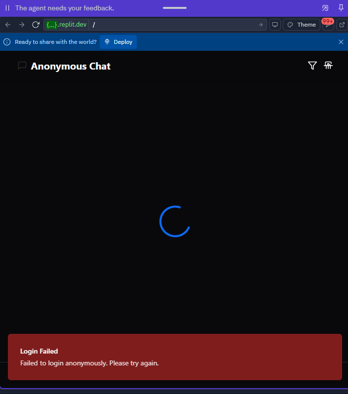

# StrangerWave - Anonymous Chat Platform

StrangerWave is a modern anonymous chat platform that connects users for text and video conversations. Similar to Omegle but with enhanced features, it provides a secure and feature-rich environment for random social interactions.



## Key Features

- **Anonymous Matching**: Connect with random strangers worldwide
- **Text & Video Chat**: Seamless switching between text and video conversations  
- **Smart Filters**: Match based on gender, country, and interests
- **Mobile Ready**: Fully responsive with native mobile apps via Capacitor
- **Premium Features**: Subscription options for enhanced capabilities
- **AI Moderation**: Content filtering for a safer experience

## What Makes StrangerWave Unique

StrangerWave stands out from similar platforms with these key differentiators:

- **Advanced Video Technology**: Adaptive quality with bandwidth optimization
- **Inclusive Design**: Comprehensive gender options beyond binary choices
- **Multi-Tier Monetization**: Premium subscriptions, unban system, and token economy
- **Modern Architecture**: Built with cutting-edge technologies for performance and scalability
- **Enhanced Safety**: AI-powered content moderation and robust reporting tools

See the [Competitive Analysis](./docs/competitive-analysis.md) for a detailed comparison with similar platforms.

## Getting Started

### Quick Start

1. Clone this repository
2. Copy `.env.sample` to `.env` and fill in your credentials
3. Run `npm install` to install dependencies
4. Run `npm run dev` to start the development server
5. Visit `http://localhost:5000` in your browser

### Test Accounts

For immediate testing, use these demo accounts:

- **Regular User**: demo_user / StrangerWave2025!
- **Premium User**: premium_demo / Premium2025!
- **Admin**: admin_demo / AdminDemo2025!

Full details in [Demo & Test Accounts](./docs/demo-test-accounts.md)

## Documentation

Comprehensive documentation is available in the `/docs` directory:

### Technical Documentation
- [Technical Setup Guide](./docs/technical-setup-guide.md)
- [Third-Party Services Setup](./docs/third-party-services-setup.md)
- [Scalable Infrastructure](./docs/scalable-infrastructure.md)
- [Code Documentation Guide](./docs/code-documentation-guide.md)

### Business Documentation
- [Monetization Strategy & Payment Flows](./docs/monetization-and-payment-flows.md)
- [Enhanced Monetization Strategy](./docs/enhanced-monetization-strategy.md)
- [Monthly Cost Breakdown](./docs/monthly-cost-breakdown.md)
- [Competitive Analysis](./docs/competitive-analysis.md)
- [Valuation & Sales Guide](./docs/valuation-and-sales-guide.md)
- [Product Roadmap & Acquisition](./docs/product-roadmap-acquisition.md)

### Experience Enhancement
- [User Engagement & Rewards](./docs/engagement-rewards-system.md)
- [Mobile UX Enhancements](./docs/mobile-ux-enhancements.md)
- [Security & Privacy Compliance](./docs/security-privacy-compliance.md)
- [Analytics & Performance](./docs/analytics-performance-strategy.md)

### Marketing & Presentation
- [Press & Influencer Strategy](./docs/press-influencer-strategy.md)
- [Pitch Deck](./docs/pitch-deck.md) (Run `./generate-pitch-deck.sh` to create PDF)
- [Demo Video Script](./docs/demo-video-script.md)
- [Demo Sandbox Access](./docs/demo-sandbox.md)
- [App Store Preparation](./docs/app-store-preparation.md)

### Handover Resources
- [Handover Checklist](./docs/handover-checklist.md)
- [Demo & Test Accounts](./docs/demo-test-accounts.md)

For a complete overview, see the [Documentation Index](./docs/README.md).

## Technology Stack

- **Frontend**: React, TypeScript, Tailwind CSS, Framer Motion
- **Backend**: Node.js, Express
- **Database**: PostgreSQL with Drizzle ORM
- **Authentication**: Firebase Authentication
- **Real-time**: WebSockets for chat, WebRTC for video
- **Payments**: Stripe and PayPal integrations
- **Mobile**: Capacitor for cross-platform mobile apps

## Deployment

### Replit Deployment

StrangerWave is configured for one-click deployment on Replit:

1. Click the "Deploy" button on the Replit interface
2. Ensure all environment variables are properly set
3. The app will be deployed to a public `*.replit.app` URL

### Alternative Hosting Services

The application can be deployed on any standard Node.js hosting service:

```bash
# Build the application
npm run build

# Start production server
npm start
```

### Environment Variables Required for Deployment

Ensure these environment variables are configured in your deployment environment:

#### Firebase Configuration
- `VITE_FIREBASE_API_KEY` - Firebase API key
- `VITE_FIREBASE_APP_ID` - Firebase app ID
- `VITE_FIREBASE_PROJECT_ID` - Firebase project ID

#### Database
- `DATABASE_URL` - PostgreSQL connection string

#### Payment Processing
- `VITE_STRIPE_PUBLIC_KEY` - Stripe publishable key
- `STRIPE_SECRET_KEY` - Stripe secret key
- `PAYPAL_CLIENT_ID` - PayPal client ID
- `PAYPAL_CLIENT_SECRET` - PayPal secret key

The application will check for these variables on startup and warn if any are missing.

See the [Technical Setup Guide](./docs/technical-setup-guide.md) for detailed deployment instructions.

## Creating Documentation Bundle

To create a ZIP file containing all documentation and assets:

```bash
./create-docs-bundle.sh
```

This will generate `strangerwave-documentation.zip` which includes all guides, configuration templates, and assets.

## License

© 2025 StrangerWave. All Rights Reserved.

## Contact

- **Support**: support@strangerwave.com
- **Business Inquiries**: sales@strangerwave.com